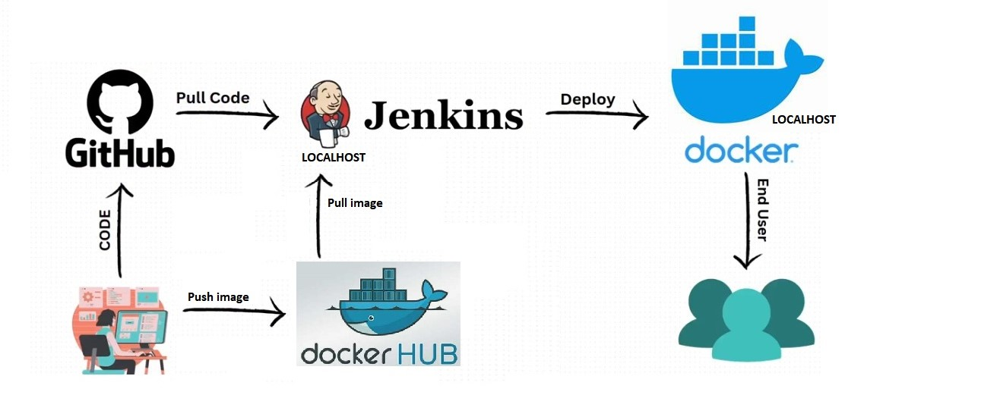

# 📝 **Task Manager App**

## 📚 **Giới thiệu**

Dự án **Task Manager App** là một ứng dụng quản lý công việc đơn giản, cung cấp các tính năng **CRUD** (Tạo, Xem, Cập nhật, Xóa) cho các tác vụ. Ứng dụng được xây dựng với:

- **Backend**: Golang (Gin Framework)  
- **Frontend**: React.js  
- **Cơ sở dữ liệu**: SQLite  
- **Docker**: Đóng gói và triển khai ứng dụng với Docker & Docker Compose  

---

## 🚀 **Tính Năng**

- 📋 **Xem danh sách công việc**  
- ➕ **Thêm công việc mới**  
- ✏️ **Chỉnh sửa công việc**  
- 🗑️ **Xóa công việc**  
- ✅ **Đánh dấu hoàn thành công việc**  

---

## 🛠️ **Cấu Trúc Dự Án**

```plaintext
task-manager/
├── backend/          # Backend Golang
│   ├── main.go       # Entry point backend
│   ├── go.mod        # Dependencies
│   ├── Dockerfile    # Docker config for backend
│   ├── database/
│   │   └── database.go # Database configuration
│   ├── handlers/     # API handlers
│   ├── models/       # Database models
│   ├── routes/       # API routes
│
├── frontend/         # Frontend React
│   ├── src/
│   │   ├── api.js    # API integration
│   │   ├── App.js    # Main app component
│   │   ├── index.js  # Entry point frontend
│   ├── package.json  # Dependencies
│   ├── Dockerfile    # Docker config for frontend
│
└── docker-compose.yml # Docker Compose configuration
```
---
## 🚀 **Jenkinsfile – Điểm Nổi Bật**  

1. **Môi Trường (Environment Variables)**  
   - Sử dụng biến môi trường `BACKEND_IMAGE` và `FRONTEND_IMAGE` để định nghĩa tên ảnh Docker cho Backend và Frontend.  

2. **Các Giai Đoạn (Stages)**  
   - **Clone Repository:** Sao chép mã nguồn từ nhánh `main` trên GitHub.  
   - **Build Docker Images:** Xây dựng ảnh Docker cho Backend và Frontend.  
   - **Push Docker Images:** Đẩy ảnh Docker lên Docker Hub với thông tin xác thực.  
   - **Deploy to DEV:** Triển khai Backend và Frontend trên môi trường phát triển (DEV) bằng Docker.  

3. **Tích Hợp Kiểm Thử (Testing)**  
   - Có một giai đoạn kiểm thử (`Run Tests`) để đảm bảo chất lượng mã nguồn.  

4. **Quản Lý Container và Mạng**  
   - Tạo mạng Docker (`dev`) nếu chưa tồn tại.  
   - Dừng và khởi chạy lại container Backend và Frontend.  

5. **Thông Báo Trạng Thái Build**  
   - Sử dụng API Telegram để gửi thông báo kết quả build (thành công/thất bại).  

6. **Dọn Dẹp Workspace**  
   - Luôn dọn dẹp workspace sau mỗi pipeline (`cleanWs`).  

---  
### 🚀 **CI/CD Pipeline**  


---

### 📡 **Tích Hợp Thông Báo Telegram**  
- Gửi tin nhắn thông báo build thành công hoặc thất bại qua API Telegram.  
- Tự động cảnh báo cho nhóm phát triển nếu pipeline gặp lỗi.  
 
---

## 💻 **Cách Chạy Dự Án**

### 🐳 **1. Chạy với Docker Compose**

1. **Clone dự án:**
   ```bash
   git clone https://github.com/Trunks-Pham/asm-devops-taskmanager.git
   cd task-manager
   ```

2. **Chạy Docker Compose:**
   ```bash
   docker-compose up --build
   ```

3. **Truy cập ứng dụng:**
   - Backend: [http://localhost:4000](http://localhost:4000)  
   - Frontend: [http://localhost:3000](http://localhost:3000)  

---

### 🛠️ **2. Chạy Backend và Frontend Thủ Công**

#### ✅ **Chạy Backend:**
```bash
cd backend
go run main.go
```

API sẽ hoạt động tại: [http://localhost:4000](http://localhost:4000)  

#### ✅ **Chạy Frontend:**
```bash
cd frontend
npm install
npm start
```

Frontend sẽ hoạt động tại: [http://localhost:3000](http://localhost:3000)  

---

## 📦 **API Endpoints**

| Method | Endpoint      | Mô Tả              |
|--------|---------------|---------------------|
| GET    | /tasks        | Lấy danh sách công việc |
| POST   | /tasks        | Tạo công việc mới     |
| PUT    | /tasks/:id    | Cập nhật công việc    |
| DELETE | /tasks/:id    | Xóa công việc         |

---

## 🛡️ **Bảo Mật**

- Sử dụng biến môi trường cho thông tin nhạy cảm  
- Xác thực và phân quyền (có thể mở rộng)  
- Validate dữ liệu đầu vào  

---

## 📞 **Liên Hệ**

- **Tác giả**: Phạm Minh Thảo  
- **Email**: minhthaopham230104@gmail.com  
- **GitHub**: [github.com/Trunks-Pham](https://github.com/Trunks-Pham)  
```